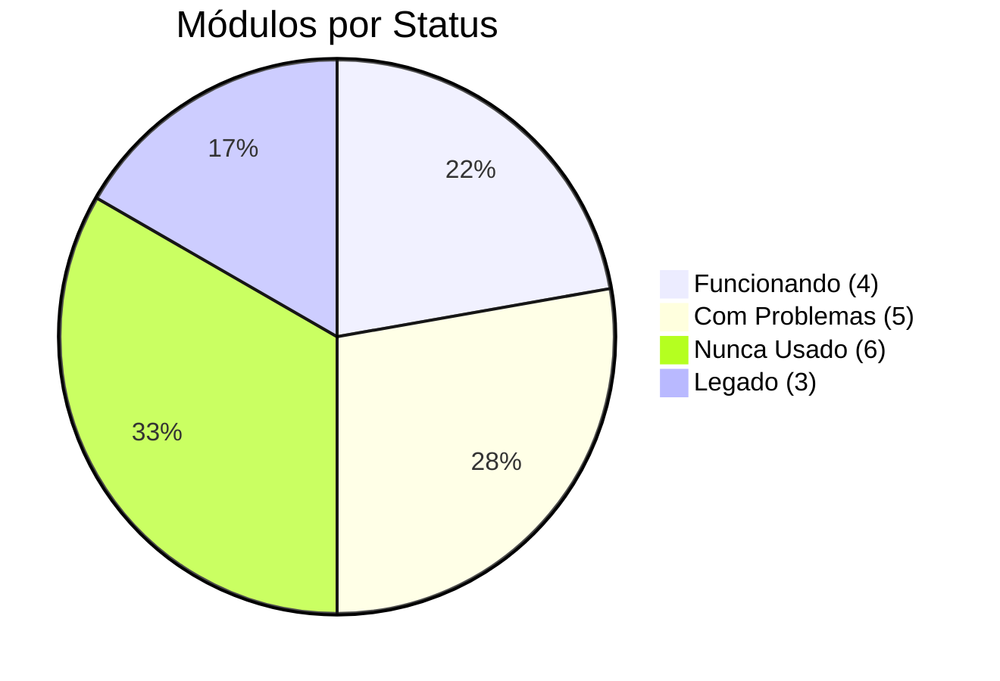
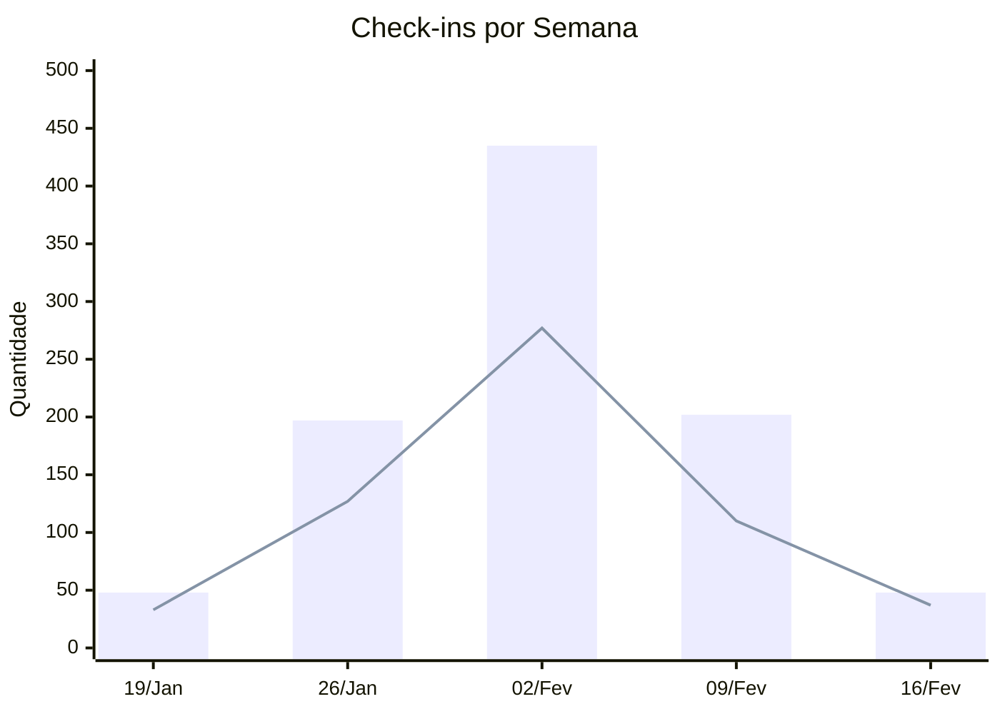
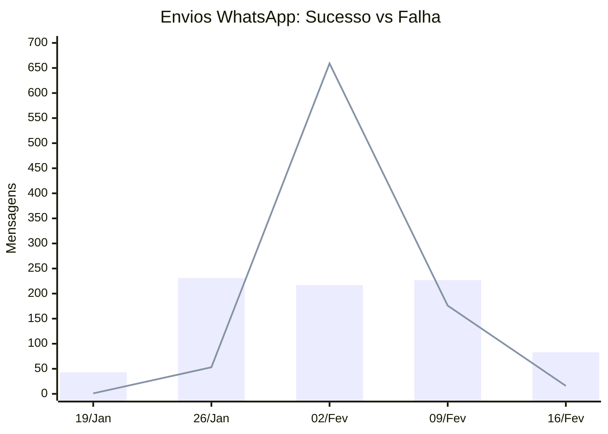
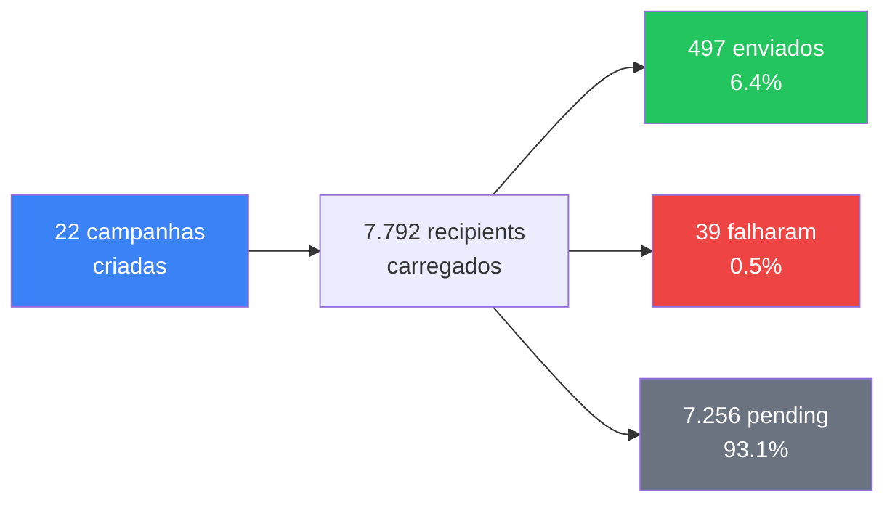
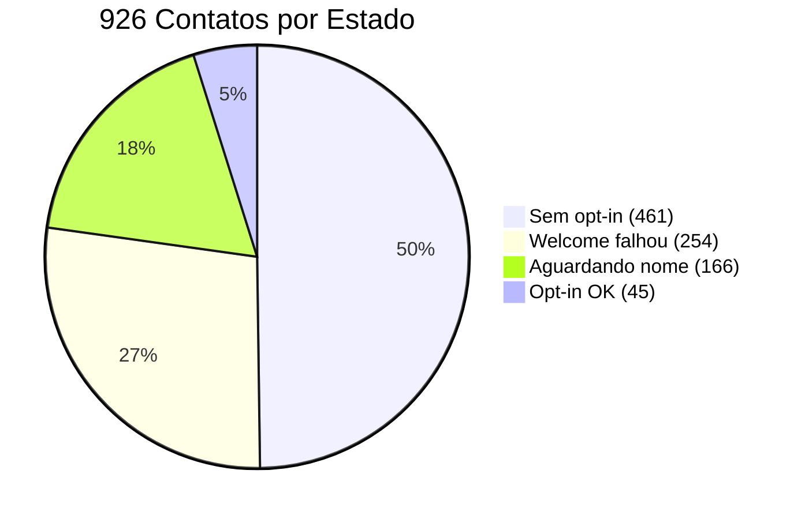
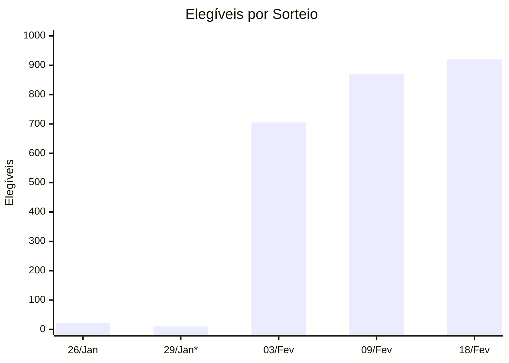
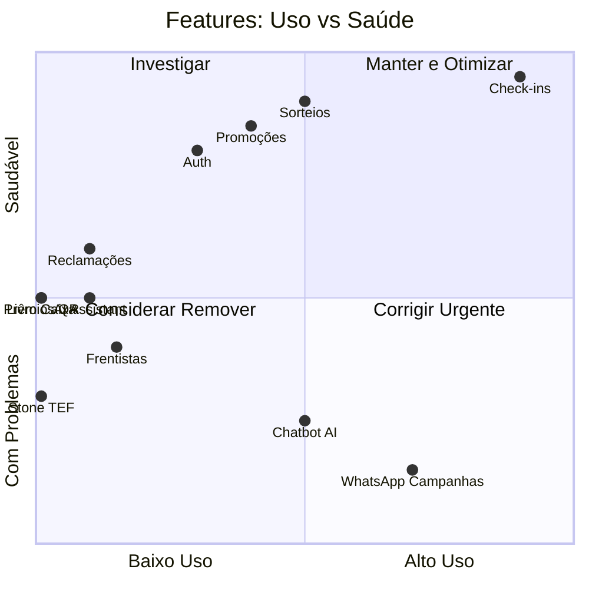

# 📊 Dashboard de Saúde — Posto 7

> Dados reais de produção · Período: 21/Jan – 19/Fev/2026 (30 dias)

---

## 🏥 Saúde Geral

| Indicador | Valor | Tendência |
|---|---|---|
| Check-ins / dia | **25** | 📈 Crescendo |
| Base de contatos | **926** | 📈 +12/semana |
| Taxa envio WhatsApp | **47%** | 🔻 Crítico |
| Sorteios realizados | **7** | ✅ Estável |
| Features em uso | **4 de 15** | ⚠️ 27% |

---

## 📈 Check-ins — Evolução Semanal

| Semana | Check-ins | Telefones Únicos | Taxa Retorno |
|---|---|---|---|
| 19/Jan | 48 | 33 | 31% |
| 26/Jan | 197 | 127 | 36% |
| 02/Fev | **435** | **277** | 36% |
| 09/Fev | 202 | 110 | 46% |
| 16/Fev | 48 | 37 | 23% |
| **Total** | **930** | **—** | **—** |

> 📌 Pico na semana de 02/Fev. Semana atual (16/Fev) ainda parcial.

---

## 📱 WhatsApp — Taxa de Sucesso vs Falha

| Semana | ✅ Enviados | ❌ Falhas | Taxa Sucesso |
|---|---|---|---|
| 19/Jan | 43 | 1 | **98%** ✅ |
| 26/Jan | 231 | 53 | **81%** ✅ |
| 02/Fev | 217 | **659** | **25%** 🔴 |
| 09/Fev | 227 | 176 | **56%** 🟡 |
| 16/Fev | 83 | 16 | **84%** ✅ |
| **Total** | **801** | **905** | **47%** |

> 🔴 **Colapso na semana 02/Fev** — 659 falhas (75%). Recuperou parcialmente depois.

---

## 🎯 Campanhas WhatsApp — Funil

| Etapa | Número | % do Total |
|---|---|---|
| Campanhas criadas | 22 | — |
| Recipients carregados | 7.792 | 100% |
| ✅ Enviados | 497 | 6.4% |
| ❌ Falharam | 39 | 0.5% |
| ⏳ Nunca processados | **7.256** | **93.1%** |
| Campanhas completadas | **0** | **0%** |

> 🔴 **93% dos recipients nunca foram processados.** Nenhuma campanha chegou ao fim.

---

## 👥 Base de Contatos — Qualidade

| Estado | Quantidade | % | Significado |
|---|---|---|---|
| `opt_in=false` | **461** | 50% | Nunca aceitaram marketing |
| `welcome_failed` | **254** | 27% | Msg boas-vindas falhou |
| `awaiting_name` | **166** | 18% | Esperando resposta |
| `opt_in=true + new` | **45** | 5% | Prontos para campanhas |

> ⚠️ Apenas **5% da base** está 100% pronta para receber campanhas.

---

## 🎰 Sorteios — Crescimento do Pool

| Data | Elegíveis | Ganhadores | Tipo |
|---|---|---|---|
| 26/Jan | 23 | 3 | Real |
| 29/Jan | 10 | 3 | *Teste* |
| 03/Fev | 705 | 5 (3 runs) | Real |
| 09/Fev | 871 | 3 | Real |
| 18/Fev | **920** | 3 | Real |

> ✅ Pool crescendo de 23 → 920 em 24 dias. Feature saudável.

---

## 🔴 Módulos Inativos (0 registros)

| Módulo | Tabelas | Investimento de Dev | Decisão Sugerida |
|---|---|---|---|
| Livro Caixa | `livro_caixa` | Alto (UI + DRE) | Ativar ou Remover |
| Prêmios QR | `premios_qr`, `premios_qr_consumos` | Alto (RPC + UI + QR) | Ativar ou Remover |
| Stone TEF | `stone_tef_logs` | Médio (Webhook + UI) | Ativar ou Remover |
| Importação CSV | `imports_logs` | Médio (Parser + UI) | Ativar ou Remover |
| Frentista Metas | `frentista_metas` | Médio (UI + lógica) | Ativar ou Remover |
| Frentista PINs | `frentistas_pins` | Baixo (hash + dialog) | Ativar ou Remover |

> 💡 **6 módulos construídos que nunca foram usados = código morto que aumenta complexidade sem gerar valor.**

---

## 📊 Scorecard Executivo

---

## ⚡ Top 3 Ações para Tomada de Decisão

| # | Ação | Impacto | Esforço |
|---|---|---|---|
| 🥇 | **Corrigir WhatsApp** — Evolution API com 53% falha, 93% recipients parados | 🔴 Crítico | Médio |
| 🥈 | **Reativar base** — 254 welcome_failed + 461 sem opt-in = 77% da base inativa | 🟡 Alto | Baixo |
| 🥉 | **Decidir sobre módulos mortos** — 6 features nunca usadas consumindo manutenção | 🟡 Médio | Baixo |

---

> 📅 Gerado: 19/02/2026 · Fonte: Banco de produção Supabase
