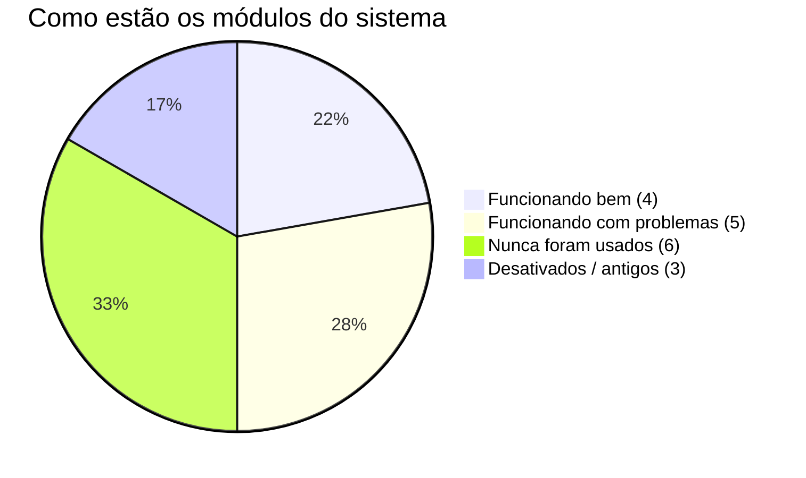
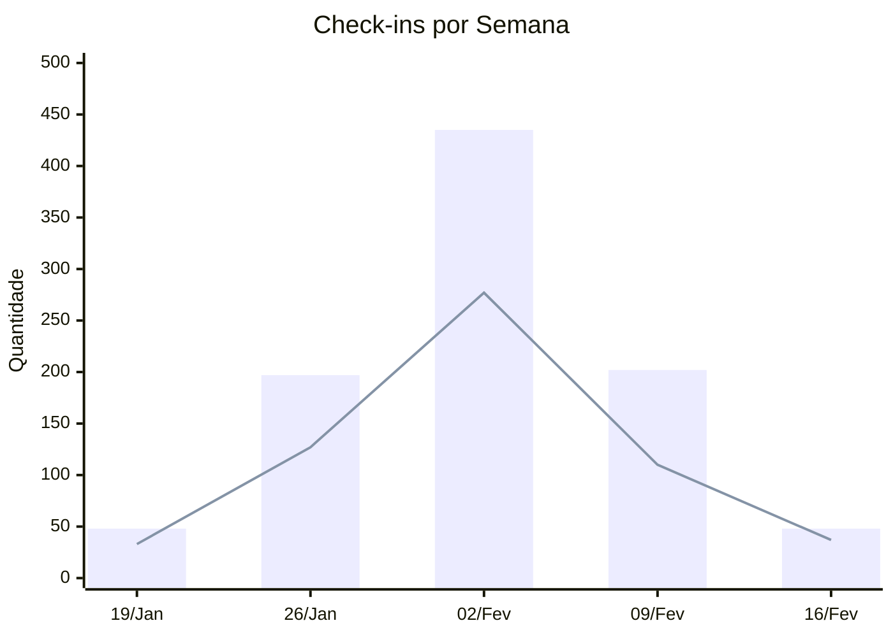
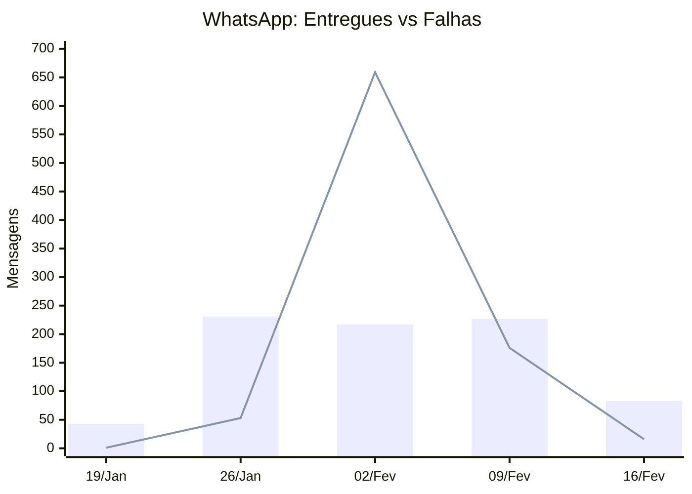
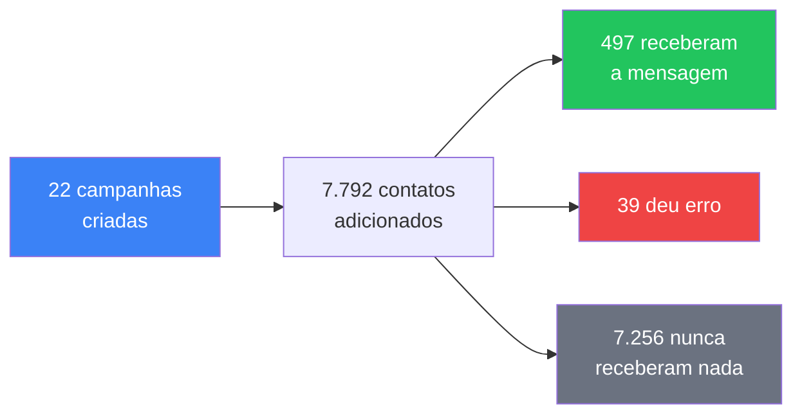
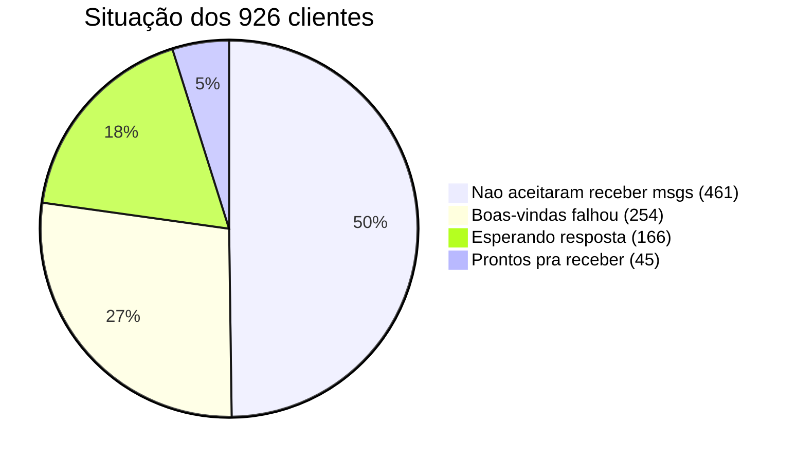
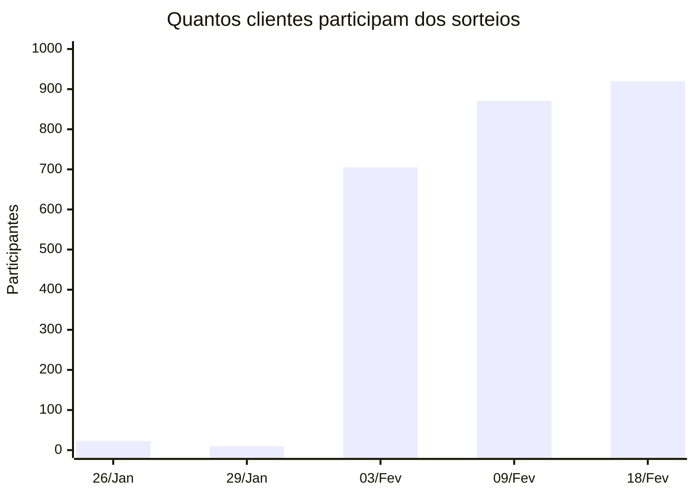

# 📊 Painel de Saúde do Sistema — Posto 7

> Dados reais do sistema · 21/Jan até 19/Fev/2026 (30 dias)

---

## 🏥 Resumo Rápido

| O que medir | Número | Como está |
|---|---|---|
| Check-ins por dia | **25** | 📈 Subindo |
| Clientes cadastrados | **926** | 📈 Crescendo |
| Mensagens WhatsApp entregues | **47%** | 🔻 Ruim |
| Sorteios feitos | **7** | ✅ Normal |
| Partes do sistema em uso | **4 de 15** | ⚠️ Só 27% |

---

## 📈 Check-ins — Como está o movimento

> Barra = total de check-ins · Linha = clientes diferentes

| Semana | Check-ins | Clientes novos | Clientes que voltaram |
|---|---|---|---|
| 19/Jan | 48 | 33 | 31% |
| 26/Jan | 197 | 127 | 36% |
| 02/Fev | **435** | **277** | 36% |
| 09/Fev | 202 | 110 | 46% |
| 16/Fev | 48 | 37 | 23% |
| **Total** | **930** | — | — |

> 📌 Melhor semana foi a de 02/Fev. A última semana ainda está incompleta.

---

## 📱 WhatsApp — Mensagens que chegaram vs que falharam

> Barra verde = entregues · Linha vermelha = falharam

| Semana | ✅ Entregues | ❌ Falharam | % que chegou |
|---|---|---|---|
| 19/Jan | 43 | 1 | **98%** ✅ |
| 26/Jan | 231 | 53 | **81%** ✅ |
| 02/Fev | 217 | **659** | **25%** 🔴 |
| 09/Fev | 227 | 176 | **56%** 🟡 |
| 16/Fev | 83 | 16 | **84%** ✅ |
| **Total** | **801** | **905** | **47%** |

> 🔴 **Na semana de 02/Fev o WhatsApp quase parou** — 75% das mensagens falharam. Depois melhorou mas ainda não está 100%.

---

## 🎯 Campanhas WhatsApp — O que aconteceu

| O que aconteceu | Quantidade | % |
|---|---|---|
| Campanhas criadas | 22 | — |
| Contatos adicionados | 7.792 | 100% |
| ✅ Receberam a mensagem | 497 | 6% |
| ❌ Deu erro no envio | 39 | 0.5% |
| ⏳ Nunca foram enviados | **7.256** | **93%** |
| Campanhas que terminaram | **0** | **0%** |

> 🔴 **93% dos contatos nunca receberam a mensagem.** Nenhuma campanha rodou até o final.

---

## 👥 Clientes — Qualidade da base

| Situação | Quantidade | % | O que significa |
|---|---|---|---|
| Não aceitaram receber | **461** | 50% | Fizeram check-in mas não aceitaram WhatsApp |
| Boas-vindas falhou | **254** | 27% | O sistema tentou mandar mensagem mas não conseguiu |
| Esperando resposta | **166** | 18% | Receberam boas-vindas mas não responderam |
| Prontos | **45** | 5% | Podem receber campanhas normalmente |

> ⚠️ **Só 45 clientes (5%) estão prontos pra receber campanhas.**

---

## 🎰 Sorteios — Funcionando bem

| Data | Participantes | Ganhadores | Observação |
|---|---|---|---|
| 26/Jan | 23 | 3 | Primeiro sorteio |
| 29/Jan | 10 | 3 | Foi um teste |
| 03/Fev | 705 | 5 | 3 sorteios no dia |
| 09/Fev | 871 | 3 | — |
| 18/Fev | **920** | 3 | Último realizado |

> ✅ **Os sorteios estão funcionando bem.** O número de participantes subiu de 23 pra 920 em 24 dias.

---

## 🔴 Partes do sistema que nunca foram usadas

| Módulo | O que faz | Quanto custou pra fazer | O que fazer? |
|---|---|---|---|
| **Livro Caixa** | Controle financeiro do posto | Bastante trabalho | Começar a usar ou tirar |
| **Prêmios QR** | Dar prêmios por QR Code | Bastante trabalho | Começar a usar ou tirar |
| **Stone TEF** | Puxar dados da maquininha | Trabalho médio | Configurar a maquininha ou tirar |
| **Importação CSV** | Importar planilha de clientes | Trabalho médio | Começar a usar ou tirar |
| **Metas de Frentista** | Meta diária/mensal pro frentista | Trabalho médio | Começar a usar ou tirar |
| **PIN de Frentista** | Senha do frentista pra validar prêmio | Pouco trabalho | Começar a usar ou tirar |

> 💡 **São 6 partes do sistema que foram construídas mas nunca ninguém usou.**

---

## 📊 Visão Geral — O que funciona e o que não funciona

| Módulo | Uso | Saúde | Onde está |
|---|---|---|---|
| ✅ Check-ins | **Alto** (930) | 🟢 Perfeito | Funciona bem, crescendo |
| ✅ Sorteios | **Médio** (7) | 🟢 Perfeito | Estável, pool crescendo |
| ✅ Promoções | **Baixo** (3) | 🟢 OK | Poucas criadas mas funciona |
| ✅ Login Admin | **Baixo** (2 users) | 🟢 OK | Funcionando |
| ⚠️ WhatsApp Campanhas | **Alto** (22 campanhas) | 🔴 **Quebrado** | 93% dos envios travados |
| ⚠️ Chatbot WhatsApp | **Médio** (887 msgs) | 🟡 Instável | 51% falha no envio |
| ⚠️ Reclamações | **Mínimo** (1) | 🟡 OK | Funciona mas ninguém usa |
| ⚠️ Assistente IA | **Mínimo** (5 msgs) | 🟡 OK | Funciona mas ninguém usa |
| ⚠️ Frentistas | **Mínimo** (3) | 🟡 Incompleto | Cadastro OK, resto parado |
| ❌ Livro Caixa | **Zero** | — | Nunca usado |
| ❌ Prêmios QR | **Zero** | — | Nunca usado |
| ❌ Stone TEF | **Zero** | — | Nunca ativado |
| ❌ Importação CSV | **Zero** | — | Nunca usado |
| ❌ Metas Frentista | **Zero** | — | Nunca usado |
| ❌ PIN Frentista | **Zero** | — | Nunca usado |

---

## ⚡ O que fazer agora — 3 prioridades

| # | O que fazer | Por quê | Dificuldade |
|---|---|---|---|
| 🥇 | **Arrumar o WhatsApp** | Mais da metade das mensagens não chegam. 93% das campanhas não foram enviadas. | Média |
| 🥈 | **Recuperar a base de clientes** | 77% dos clientes não estão recebendo nada. Precisa reenviar boas-vindas e reconquistar opt-in. | Fácil |
| 🥉 | **Decidir sobre os módulos parados** | 6 partes do sistema nunca foram usadas. Ou começa a usar ou tira pra simplificar. | Fácil |

---

> 📅 Relatório gerado em: 19/02/2026  
> 📊 Fonte: Banco de dados real do sistema
