# 🗺️ Fluxograma Completo do Sistema — Posto 7

> **Gerado em:** 19/02/2026  
> **Base:** Dados reais de produção (21/Jan – 19/Fev/2026)  
> **Legenda de status:**  
> 🟢 Ativo e funcionando · 🟡 Ativo com problemas · 🔴 Nunca usado · ⚪ Legado/Substituído

---

## 📋 Índice

1. [Visão Geral da Arquitetura](#1-visão-geral-da-arquitetura)
2. [Módulo Check-in (PWA)](#2-módulo-check-in-pwa)
3. [Módulo WhatsApp — Robô de Campanhas](#3-módulo-whatsapp--robô-de-campanhas)
4. [Módulo WhatsApp — Chatbot AI](#4-módulo-whatsapp--chatbot-ai)
5. [Módulo Sorteios](#5-módulo-sorteios)
6. [Módulo Frentistas](#6-módulo-frentistas)
7. [Módulo Prêmios QR](#7-módulo-prêmios-qr)
8. [Módulo Livro Caixa](#8-módulo-livro-caixa)
9. [Módulo Stone TEF](#9-módulo-stone-tef)
10. [Módulo Promoções](#10-módulo-promoções)
11. [Módulo Reclamações](#11-módulo-reclamações)
12. [Módulo AI Assistant (Admin)](#12-módulo-ai-assistant-admin)
13. [Módulo Importação CSV](#13-módulo-importação-csv)
14. [Autenticação & RBAC](#14-autenticação--rbac)
15. [Tabelas Legadas / Substituídas](#15-tabelas-legadas--substituídas)
16. [Resumo de Saúde do Sistema](#16-resumo-de-saúde-do-sistema)

---

## 1. Visão Geral da Arquitetura

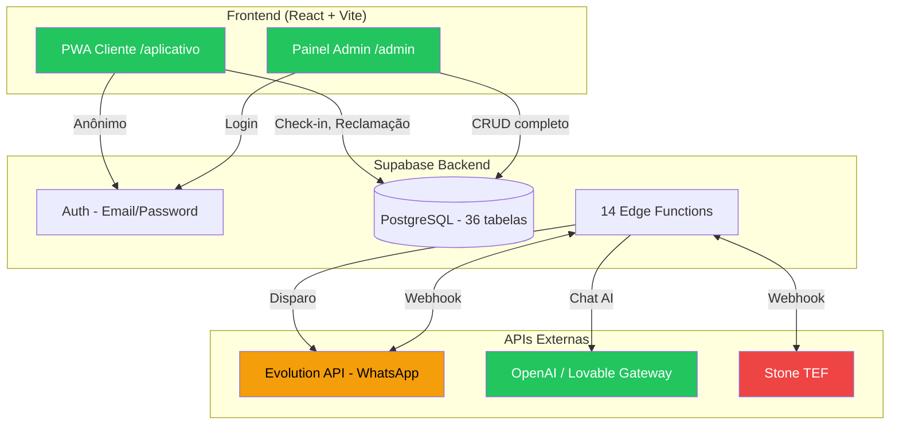
```mermaid
graph TB
    subgraph "Frontend (React + Vite)"
        PWA[PWA Cliente /aplicativo]
        ADMIN[Painel Admin /admin]
    end

    subgraph "Supabase Backend"
        AUTH[Auth - Email/Password]
        DB[(PostgreSQL - 36 tabelas)]
        EF[14 Edge Functions]
    end

    subgraph "APIs Externas"
        EVO[Evolution API - WhatsApp]
        OPENAI[OpenAI / Lovable Gateway]
        STONE[Stone TEF]
    end

    PWA -->|Check-in, Reclamação| DB
    PWA -->|Anônimo| AUTH
    ADMIN -->|CRUD completo| DB
    ADMIN -->|Login| AUTH
    EF -->|Disparo| EVO
    EF -->|Chat AI| OPENAI
    EF <-->|Webhook| STONE
    EF <-->|Webhook| EVO

    style PWA fill:#22c55e,color:#fff
    style ADMIN fill:#22c55e,color:#fff
    style EVO fill:#f59e0b,color:#000
    style STONE fill:#ef4444,color:#fff
    style OPENAI fill:#22c55e,color:#fff
```

### Números Reais de Produção

| Métrica | Valor |
|---|---|
| Usuários admin | 2 (clovis=admin, eduardo=admin) |
| Contatos WhatsApp | 926 |
| Check-ins totais | 930 (100% reais, 0 demo) |
| Campanhas WhatsApp | 22 criadas |
| Sorteios executados | 7 (6 reais + 1 teste) |
| Período ativo | ~30 dias |

---

## 2. Módulo Check-in (PWA) 🟢

**Status: ATIVO — Feature mais usada do sistema**  
**930 check-ins | ~25/dia | 352 telefones únicos em Fev**

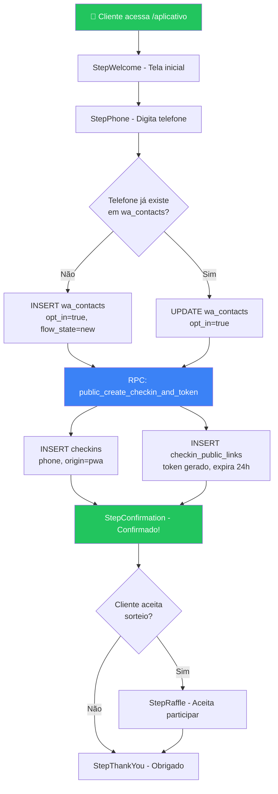
```mermaid
flowchart TD
    A[👤 Cliente acessa /aplicativo] --> B[StepWelcome - Tela inicial]
    B --> C[StepPhone - Digita telefone]
    C --> D{Telefone já existe\nem wa_contacts?}
    
    D -->|Não| E[INSERT wa_contacts\nopt_in=true, flow_state=new]
    D -->|Sim| F[UPDATE wa_contacts\nopt_in=true]
    
    E --> G[RPC: public_create_checkin_and_token]
    F --> G
    
    G --> H[INSERT checkins\nphone, origin=pwa]
    G --> I[INSERT checkin_public_links\ntoken gerado, expira 24h]
    
    H --> J[StepConfirmation - Confirmado!]
    I --> J
    
    J --> K{Cliente aceita\nsorteio?}
    K -->|Sim| L[StepRaffle - Aceita participar]
    K -->|Não| M[StepThankYou - Obrigado]
    L --> M

    style A fill:#22c55e,color:#fff
    style G fill:#3b82f6,color:#fff
    style J fill:#22c55e,color:#fff
```

### Tabelas envolvidas

| Tabela | Registros | Status |
|---|---|---|
| `checkins` | 930 | 🟢 100% reais, origin=pwa, sem tag |
| `wa_contacts` | 926 | 🟢 Crescendo com check-ins |
| `checkin_public_links` | 878 | 🟢 Links de acompanhamento |

### ⚠️ Observação sobre wa_contacts

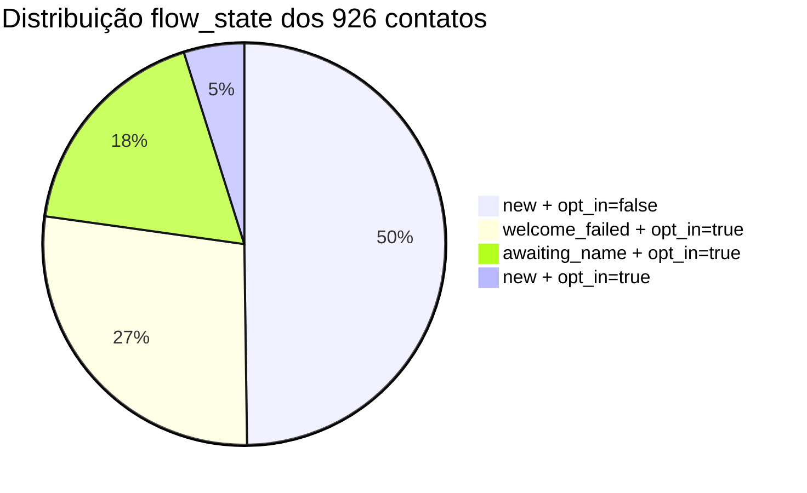
```mermaid
pie title Distribuição flow_state dos 926 contatos
    "new + opt_in=false" : 461
    "welcome_failed + opt_in=true" : 254
    "awaiting_name + opt_in=true" : 166
    "new + opt_in=true" : 45
```

> **Problema:** 461 contatos (50%) estão com `opt_in=false` e `flow_state=new` — nunca completaram o fluxo de boas-vindas.  
> **Problema:** 254 contatos (27%) têm `flow_state=welcome_failed` — a mensagem de boas-vindas falhou no envio.

---

## 3. Módulo WhatsApp — Robô de Campanhas 🟡

**Status: ATIVO COM PROBLEMAS — Taxa de falha de 53%**  
**22 campanhas | 7.792 recipients | 0 campanhas completadas**

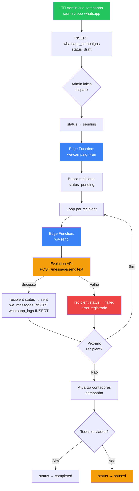
```mermaid
flowchart TD
    A[👨‍💼 Admin cria campanha\n/admin/robo-whatsapp] --> B[INSERT whatsapp_campaigns\nstatus=draft]
    
    B --> C{Admin inicia\ndisparo}
    C --> D[status → sending]
    
    D --> E[Edge Function:\nwa-campaign-run]
    
    E --> F[Busca recipients\nstatus=pending]
    F --> G[Loop por recipient]
    
    G --> H[Edge Function:\nwa-send]
    H --> I[Evolution API\nPOST /message/sendText]
    
    I -->|Sucesso| J[recipient status → sent\nwa_messages INSERT\nwhatsapp_logs INSERT]
    I -->|Falha| K[recipient status → failed\nerror registrado]
    
    J --> L{Próximo\nrecipient?}
    K --> L
    L -->|Sim| G
    L -->|Não| M[Atualiza contadores\ncampanha]
    
    M --> N{Todos enviados?}
    N -->|Sim| O[status → completed]
    N -->|Não| P[status → paused]

    style A fill:#22c55e,color:#fff
    style E fill:#3b82f6,color:#fff
    style H fill:#3b82f6,color:#fff
    style I fill:#f59e0b,color:#000
    style K fill:#ef4444,color:#fff
    style P fill:#f59e0b,color:#000
```

### Diagnóstico Real das Campanhas

| Status | Campanhas | Recipients |
|---|---|---|
| `paused` | 17 | 0 (contadores não atualizados) |
| `draft` | 3 | 142 |
| `sending` (travado) | 2 | 0 |
| `completed` | **0** | **0** |

### Recipients (7.792 total)

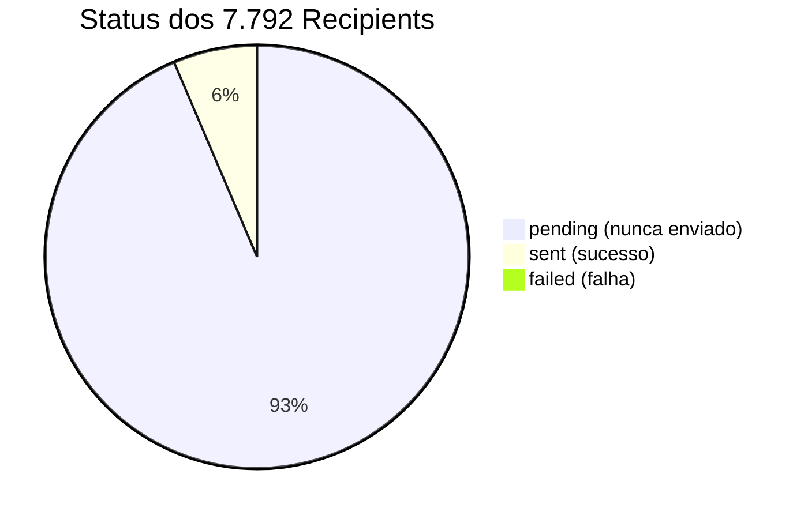
```mermaid
pie title Status dos 7.792 Recipients
    "pending (nunca enviado)" : 7256
    "sent (sucesso)" : 497
    "failed (falha)" : 39
```

### WhatsApp Logs (1.706 total)

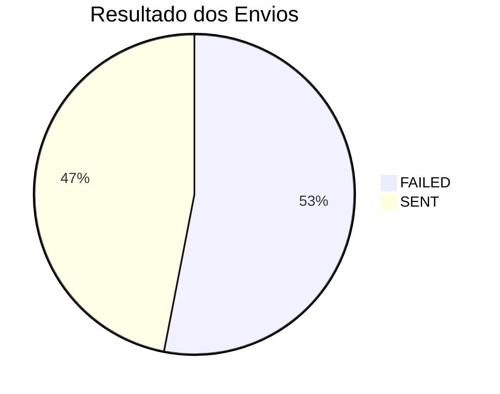
```mermaid
pie title Resultado dos Envios
    "FAILED" : 905
    "SENT" : 801
```

### wa_messages (887 total)

| Direction | Status | Count |
|---|---|---|
| outbound | failed | 455 |
| outbound | sent | 432 |

### 🔴 Erros Identificados

1. **0 campanhas completadas** — Nenhuma campanha chegou ao status `completed`
2. **93% dos recipients ainda pending** — 7.256 de 7.792 nunca foram processados
3. **53% de falha nos envios** — Evolution API instável (905 FAILED vs 801 SENT)
4. **Contadores zerados** — `sent_count` e `failed_count` das campanhas = 0, apesar de ter recipients processados
5. **2 campanhas travadas em `sending`** — Nunca concluíram o loop

---

## 4. Módulo WhatsApp — Chatbot AI 🟡

**Status: ATIVO — Processando mensagens recebidas**

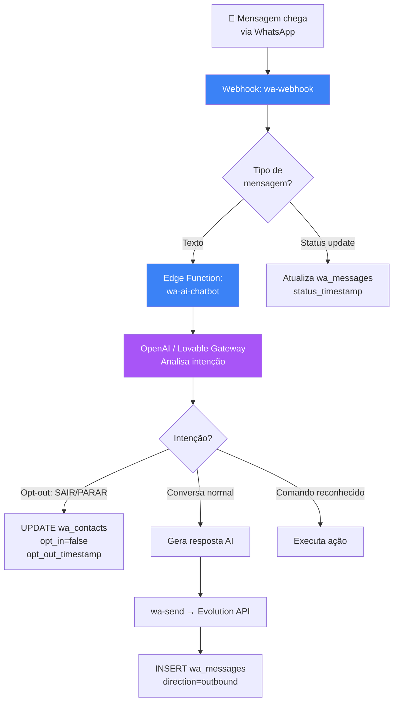
```mermaid
flowchart TD
    A[📱 Mensagem chega\nvia WhatsApp] --> B[Webhook: wa-webhook]
    B --> C{Tipo de\nmensagem?}
    
    C -->|Texto| D[Edge Function:\nwa-ai-chatbot]
    C -->|Status update| E[Atualiza wa_messages\nstatus_timestamp]
    
    D --> F[OpenAI / Lovable Gateway\nAnalisa intenção]
    F --> G{Intenção?}
    
    G -->|Opt-out: SAIR/PARAR| H[UPDATE wa_contacts\nopt_in=false\nopt_out_timestamp]
    G -->|Conversa normal| I[Gera resposta AI]
    G -->|Comando reconhecido| J[Executa ação]
    
    I --> K[wa-send → Evolution API]
    K --> L[INSERT wa_messages\ndirection=outbound]

    style B fill:#3b82f6,color:#fff
    style D fill:#3b82f6,color:#fff
    style F fill:#a855f7,color:#fff
```

> **Nota:** O chatbot está processando mensagens (887 wa_messages), mas a taxa de falha no envio de respostas é alta (455 failed de 887).

---

## 5. Módulo Sorteios 🟢

**Status: ATIVO — 7 sorteios executados (6 reais + 1 teste)**

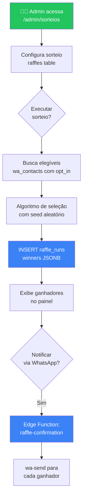
```mermaid
flowchart TD
    A[👨‍💼 Admin acessa\n/admin/sorteios] --> B[Configura sorteio\nraffles table]
    
    B --> C{Executar\nsorteio?}
    C --> D[Busca elegíveis\nwa_contacts com opt_in]
    
    D --> E[Algoritmo de seleção\ncom seed aleatório]
    E --> F[INSERT raffle_runs\nwinners JSONB]
    
    F --> G[Exibe ganhadores\nno painel]
    G --> H{Notificar\nvia WhatsApp?}
    H -->|Sim| I[Edge Function:\nraffle-confirmation]
    I --> J[wa-send para\ncada ganhador]

    style A fill:#22c55e,color:#fff
    style F fill:#3b82f6,color:#fff
    style I fill:#3b82f6,color:#fff
```

### Histórico de Sorteios

| Data | Elegíveis | Ganhadores | Tipo |
|---|---|---|---|
| 18/02/2026 | 920 | 3 | Real |
| 09/02/2026 | 871 | 3 | Real |
| 03/02/2026 | 705 | 3 | Real |
| 03/02/2026 | 705 | 1 | Real |
| 03/02/2026 | 705 | 1 | Real |
| 29/01/2026 | 10 | 3 | Teste |
| 26/01/2026 | 23 | 3 | Real |

> ✅ Feature estável. Pool de elegíveis crescendo (23 → 920).

---

## 6. Módulo Frentistas 🟡

**Status: PARCIALMENTE ATIVO — Cadastro básico feito, sub-features não usadas**

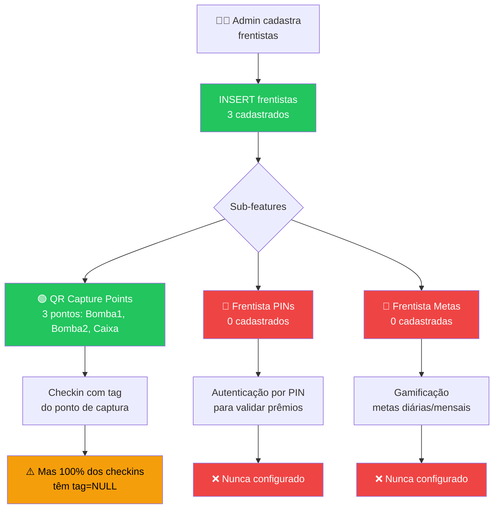
```mermaid
flowchart TD
    A[👨‍💼 Admin cadastra\nfrentistas] --> B[INSERT frentistas\n3 cadastrados]
    
    B --> C{Sub-features}
    
    C --> D[🟢 QR Capture Points\n3 pontos: Bomba1, Bomba2, Caixa]
    C --> E[🔴 Frentista PINs\n0 cadastrados]
    C --> F[🔴 Frentista Metas\n0 cadastradas]
    
    D --> G[Checkin com tag\ndo ponto de captura]
    G --> H[⚠️ Mas 100% dos checkins\ntêm tag=NULL]
    
    E --> I[Autenticação por PIN\npara validar prêmios]
    I --> J[❌ Nunca configurado]
    
    F --> K[Gamificação\nmetas diárias/mensais]
    K --> L[❌ Nunca configurado]

    style B fill:#22c55e,color:#fff
    style D fill:#22c55e,color:#fff
    style E fill:#ef4444,color:#fff
    style F fill:#ef4444,color:#fff
    style H fill:#f59e0b,color:#000
    style J fill:#ef4444,color:#fff
    style L fill:#ef4444,color:#fff
```

### Dados Reais

| Sub-feature | Registros | Status |
|---|---|---|
| Frentistas | 3 (Frentista 1, 2, 3) | 🟢 Ativos |
| QR Capture Points | 3 (Bomba1, Bomba2, Caixa) | 🟡 Criados mas sem frentista vinculado |
| Frentista PINs | 0 | 🔴 Nunca usado |
| Frentista Metas | 0 | 🔴 Nunca usado |

> **Nota:** Os 3 QR Capture Points existem mas `frentista_id=NULL` em todos. Os check-ins não usam `tag`, então não há como saber de qual bomba veio.

---

## 7. Módulo Prêmios QR 🔴

**Status: NUNCA USADO — 0 prêmios criados**

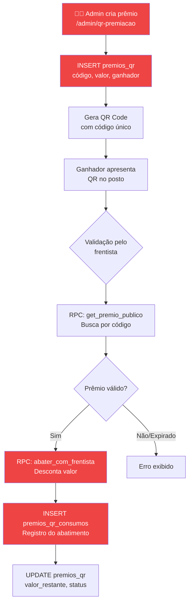
```mermaid
flowchart TD
    A[👨‍💼 Admin cria prêmio\n/admin/qr-premiacao] --> B[INSERT premios_qr\ncódigo, valor, ganhador]
    
    B --> C[Gera QR Code\ncom código único]
    C --> D[Ganhador apresenta\nQR no posto]
    
    D --> E{Validação pelo\nfrentista}
    E --> F[RPC: get_premio_publico\nBusca por código]
    
    F --> G{Prêmio válido?}
    G -->|Sim| H[RPC: abater_com_frentista\nDesconta valor]
    G -->|Não/Expirado| I[Erro exibido]
    
    H --> J[INSERT premios_qr_consumos\nRegistro do abatimento]
    J --> K[UPDATE premios_qr\nvalor_restante, status]

    style A fill:#ef4444,color:#fff
    style B fill:#ef4444,color:#fff
    style H fill:#ef4444,color:#fff
    style J fill:#ef4444,color:#fff
```

| Tabela | Registros | Status |
|---|---|---|
| `premios_qr` | 0 | 🔴 |
| `premios_qr_consumos` | 0 | 🔴 |
| `frentistas_pins` | 0 | 🔴 (necessário para validar) |

> **Conclusão:** O módulo está 100% construído (RPC functions, UI, fluxo de validação) mas nunca foi utilizado. Depende de `frentistas_pins` que também nunca foi configurado.

---

## 8. Módulo Livro Caixa 🔴

**Status: NUNCA USADO — 0 lançamentos**

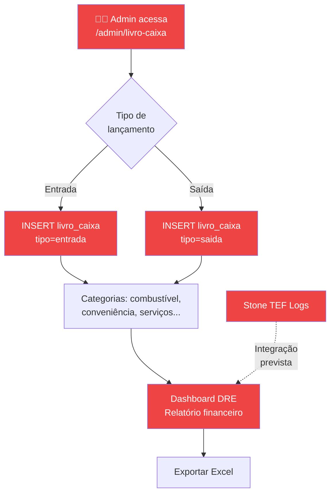
```mermaid
flowchart TD
    A[👨‍💼 Admin acessa\n/admin/livro-caixa] --> B{Tipo de\nlançamento}
    
    B -->|Entrada| C[INSERT livro_caixa\ntipo=entrada]
    B -->|Saída| D[INSERT livro_caixa\ntipo=saida]
    
    C --> E[Categorias: combustível,\nconveniência, serviços...]
    D --> E
    
    E --> F[Dashboard DRE\nRelatório financeiro]
    F --> G[Exportar Excel]
    
    H[Stone TEF Logs] -.->|Integração\nprevista| F

    style A fill:#ef4444,color:#fff
    style C fill:#ef4444,color:#fff
    style D fill:#ef4444,color:#fff
    style F fill:#ef4444,color:#fff
    style H fill:#ef4444,color:#fff
```

| Tabela | Registros | Status |
|---|---|---|
| `livro_caixa` | 0 | 🔴 |
| `stone_tef_logs` | 0 | 🔴 (alimentaria o DRE) |

---

## 9. Módulo Stone TEF 🔴

**Status: NUNCA USADO — Integração não ativada**

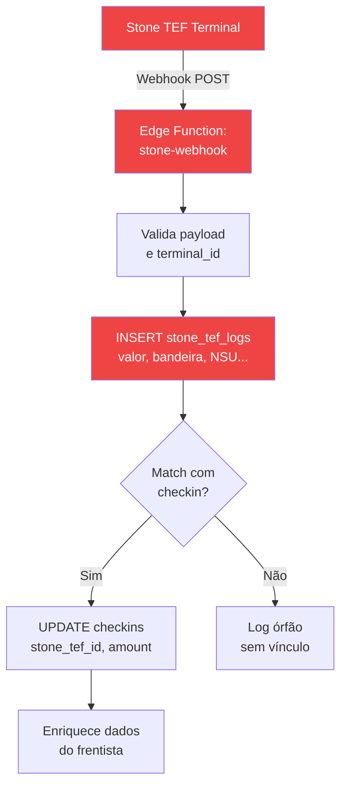
```mermaid
flowchart TD
    A[Stone TEF Terminal] -->|Webhook POST| B[Edge Function:\nstone-webhook]
    
    B --> C[Valida payload\ne terminal_id]
    C --> D[INSERT stone_tef_logs\nvalor, bandeira, NSU...]
    
    D --> E{Match com\ncheckin?}
    E -->|Sim| F[UPDATE checkins\nstone_tef_id, amount]
    E -->|Não| G[Log órfão\nsem vínculo]
    
    F --> H[Enriquece dados\ndo frentista]

    style A fill:#ef4444,color:#fff
    style B fill:#ef4444,color:#fff
    style D fill:#ef4444,color:#fff
```

| Tabela | Registros | Status |
|---|---|---|
| `stone_tef_logs` | 0 | 🔴 Webhook nunca recebeu dados |

> **Nota:** A Edge Function `stone-webhook` existe e está deployada, mas o terminal Stone nunca foi configurado para enviar webhooks.

---

## 10. Módulo Promoções 🟢

**Status: ATIVO — 3 promoções cadastradas**

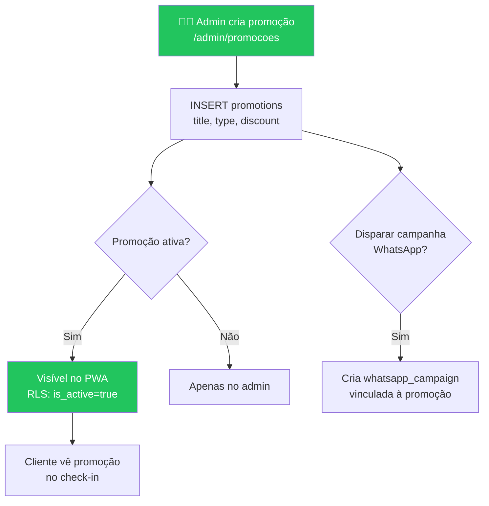
```mermaid
flowchart TD
    A[👨‍💼 Admin cria promoção\n/admin/promocoes] --> B[INSERT promotions\ntitle, type, discount]
    
    B --> C{Promoção ativa?}
    C -->|Sim| D[Visível no PWA\nRLS: is_active=true]
    C -->|Não| E[Apenas no admin]
    
    D --> F[Cliente vê promoção\nno check-in]
    
    B --> G{Disparar campanha\nWhatsApp?}
    G -->|Sim| H[Cria whatsapp_campaign\nvinculada à promoção]

    style A fill:#22c55e,color:#fff
    style D fill:#22c55e,color:#fff
```

> ✅ 3 promoções criadas. Integra com campanhas WhatsApp para disparo.

---

## 11. Módulo Reclamações 🟡

**Status: FUNCIONAL MAS SUBUTILIZADO — 1 reclamação em 30 dias**

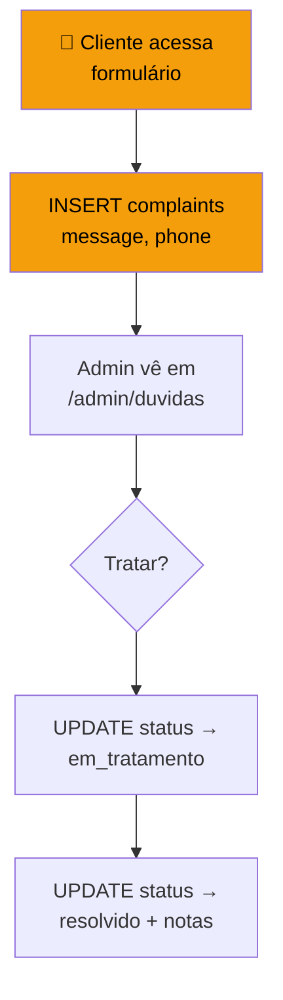
```mermaid
flowchart TD
    A[👤 Cliente acessa\nformulário] --> B[INSERT complaints\nmessage, phone]
    
    B --> C[Admin vê em\n/admin/duvidas]
    C --> D{Tratar?}
    D --> E[UPDATE status →\nem_tratamento]
    E --> F[UPDATE status →\nresolvido + notas]

    style A fill:#f59e0b,color:#000
    style B fill:#f59e0b,color:#000
```

| Tabela | Registros | Status |
|---|---|---|
| `complaints` | 1 | 🟡 Funcional mas quase sem uso |

---

## 12. Módulo AI Assistant (Admin) 🟡

**Status: ATIVO — Pouco uso (5 mensagens, 15/Fev)**

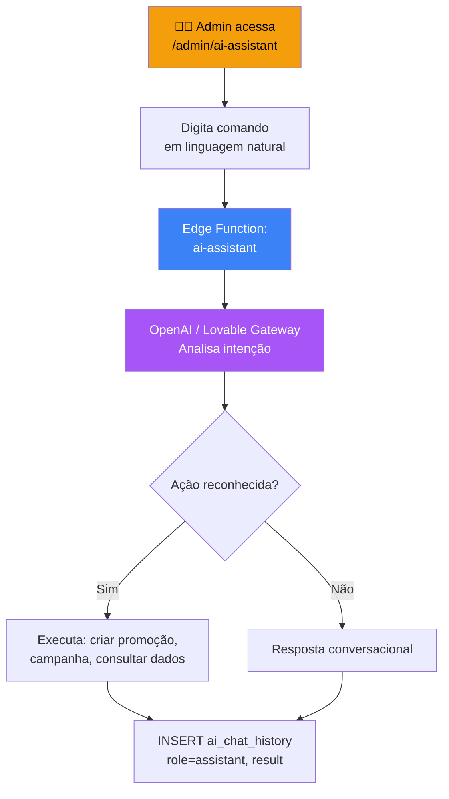
```mermaid
flowchart TD
    A[👨‍💼 Admin acessa\n/admin/ai-assistant] --> B[Digita comando\nem linguagem natural]
    
    B --> C[Edge Function:\nai-assistant]
    C --> D[OpenAI / Lovable Gateway\nAnalisa intenção]
    
    D --> E{Ação reconhecida?}
    E -->|Sim| F[Executa: criar promoção,\ncampanha, consultar dados]
    E -->|Não| G[Resposta conversacional]
    
    F --> H[INSERT ai_chat_history\nrole=assistant, result]
    G --> H

    style A fill:#f59e0b,color:#000
    style C fill:#3b82f6,color:#fff
    style D fill:#a855f7,color:#fff
```

| Tabela | Registros | Status |
|---|---|---|
| `ai_chat_history` | 5 | 🟡 Pouco uso |
| `ai_commands` | 14 | 🟢 Configurados |
| `ai_command_logs` | 0 | 🔴 Logging não funciona |
| `ai_settings` | 8 | 🟢 Configurados |
| `ai_whatsapp_logs` | 3 | 🟡 Mínimo uso |

---

## 13. Módulo Importação CSV 🔴

**Status: NUNCA USADO — 0 importações**

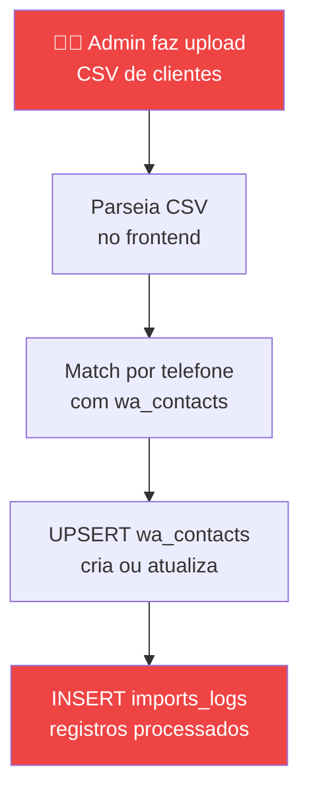
```mermaid
flowchart TD
    A[👨‍💼 Admin faz upload\nCSV de clientes] --> B[Parseia CSV\nno frontend]
    B --> C[Match por telefone\ncom wa_contacts]
    C --> D[UPSERT wa_contacts\ncria ou atualiza]
    D --> E[INSERT imports_logs\nregistros processados]

    style A fill:#ef4444,color:#fff
    style E fill:#ef4444,color:#fff
```

| Tabela | Registros | Status |
|---|---|---|
| `imports_logs` | 0 | 🔴 |

---

## 14. Autenticação & RBAC 🟢

**Status: ATIVO — 2 usuários admin**

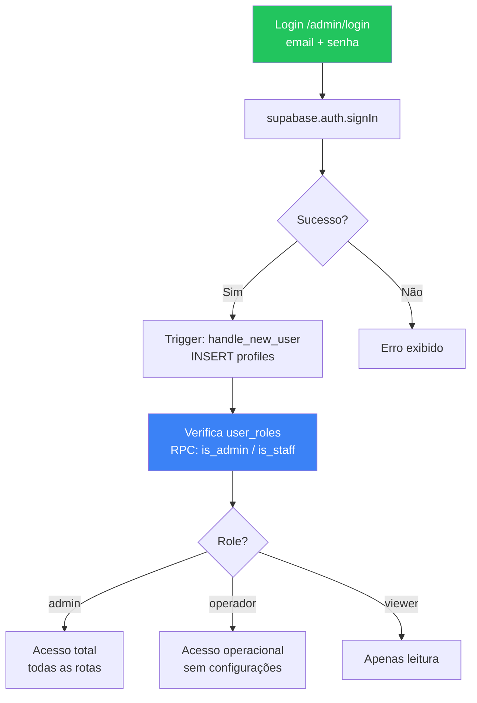
```mermaid
flowchart TD
    A[Login /admin/login\nemail + senha] --> B[supabase.auth.signIn]
    
    B --> C{Sucesso?}
    C -->|Sim| D[Trigger: handle_new_user\nINSERT profiles]
    C -->|Não| E[Erro exibido]
    
    D --> F[Verifica user_roles\nRPC: is_admin / is_staff]
    
    F --> G{Role?}
    G -->|admin| H[Acesso total\ntodas as rotas]
    G -->|operador| I[Acesso operacional\nsem configurações]
    G -->|viewer| J[Apenas leitura]

    style A fill:#22c55e,color:#fff
    style F fill:#3b82f6,color:#fff
```

### Usuários em Produção

| Email | Profile Role | User Role | Status |
|---|---|---|---|
| clovisteodoro349@gmail.com | admin | admin | 🟢 |
| eduardolima384@gmail.com | viewer | admin | ⚠️ Divergência profile vs user_roles |

> **⚠️ Bug:** Eduardo tem `role=viewer` em `profiles` mas `role=admin` em `user_roles`. O sistema usa `user_roles` para RLS, então funciona como admin, mas há inconsistência.

---

## 15. Tabelas Legadas / Substituídas

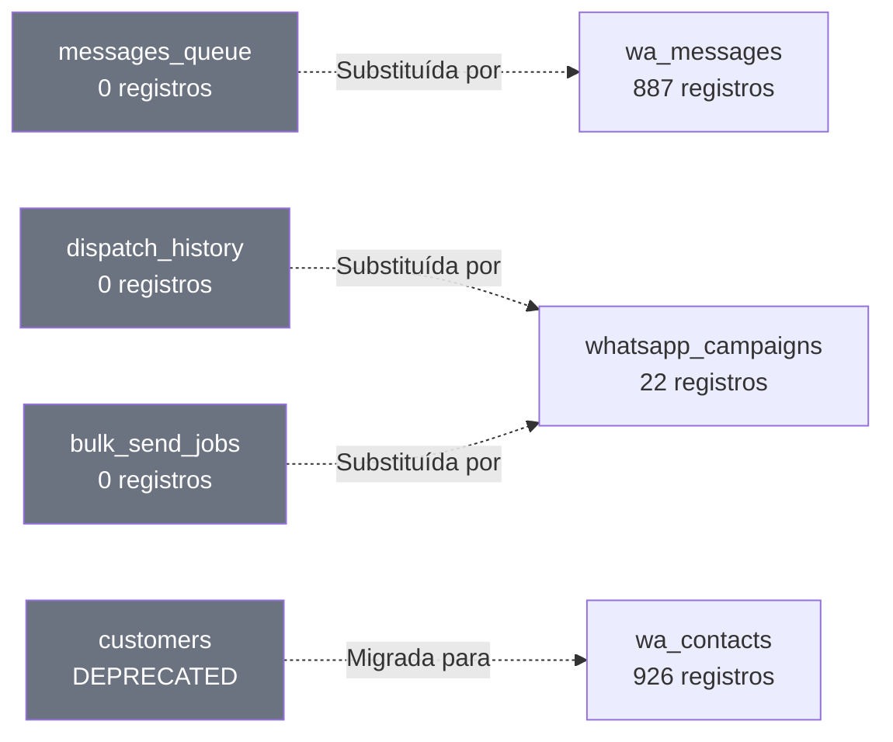
```mermaid
flowchart LR
    A[messages_queue\n0 registros] -.->|Substituída por| B[wa_messages\n887 registros]
    C[dispatch_history\n0 registros] -.->|Substituída por| D[whatsapp_campaigns\n22 registros]
    E[bulk_send_jobs\n0 registros] -.->|Substituída por| D
    F[customers\nDEPRECATED] -.->|Migrada para| G[wa_contacts\n926 registros]

    style A fill:#6b7280,color:#fff
    style C fill:#6b7280,color:#fff
    style E fill:#6b7280,color:#fff
    style F fill:#6b7280,color:#fff
```

| Tabela Legada | Registros | Substituída Por |
|---|---|---|
| `messages_queue` | 0 | `wa_messages` |
| `dispatch_history` | 0 | `whatsapp_campaigns` + `whatsapp_campaign_recipients` |
| `bulk_send_jobs` | 0 | `whatsapp_campaigns` |
| `customers` (schema antigo) | — | `wa_contacts` |

---

## 16. Resumo de Saúde do Sistema

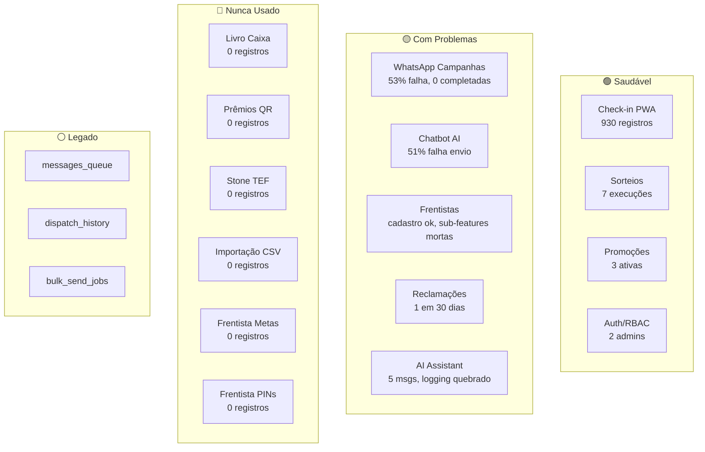
```mermaid
graph TD
    subgraph "🟢 Saudável"
        CK[Check-in PWA\n930 registros]
        ST[Sorteios\n7 execuções]
        PR[Promoções\n3 ativas]
        AU[Auth/RBAC\n2 admins]
    end

    subgraph "🟡 Com Problemas"
        WA[WhatsApp Campanhas\n53% falha, 0 completadas]
        CB[Chatbot AI\n51% falha envio]
        FR[Frentistas\ncadastro ok, sub-features mortas]
        RC[Reclamações\n1 em 30 dias]
        AI[AI Assistant\n5 msgs, logging quebrado]
    end

    subgraph "🔴 Nunca Usado"
        LC[Livro Caixa\n0 registros]
        PQ[Prêmios QR\n0 registros]
        TEF[Stone TEF\n0 registros]
        CSV[Importação CSV\n0 registros]
        FM[Frentista Metas\n0 registros]
        FP[Frentista PINs\n0 registros]
    end

    subgraph "⚪ Legado"
        MQ[messages_queue]
        DH[dispatch_history]
        BS[bulk_send_jobs]
    end
```

### Tabela Final de Saúde

| # | Módulo | Status | Registros | Erro Crítico? |
|---|---|---|---|---|
| 1 | Check-in PWA | 🟢 | 930 | Não |
| 2 | wa_contacts | 🟢 | 926 | 50% sem opt-in |
| 3 | Sorteios | 🟢 | 7 runs | Não |
| 4 | Promoções | 🟢 | 3 | Não |
| 5 | Auth/RBAC | 🟢 | 2 users | Divergência profile/role |
| 6 | WhatsApp Campanhas | 🟡 | 22/7792 | **SIM: 53% falha, 0 completadas** |
| 7 | WhatsApp Chatbot | 🟡 | 887 msgs | **SIM: 51% falha envio** |
| 8 | Frentistas | 🟡 | 3 | QR points sem vínculo |
| 9 | Reclamações | 🟡 | 1 | Subutilizado |
| 10 | AI Assistant | 🟡 | 5 msgs | Logging não grava |
| 11 | Livro Caixa | 🔴 | 0 | Nunca usado |
| 12 | Prêmios QR | 🔴 | 0 | Nunca usado |
| 13 | Stone TEF | 🔴 | 0 | Nunca ativado |
| 14 | Importação CSV | 🔴 | 0 | Nunca usado |
| 15 | Frentista Metas | 🔴 | 0 | Nunca usado |
| 16 | Frentista PINs | 🔴 | 0 | Nunca usado |

### 🎯 Prioridades de Correção

1. **URGENTE:** Investigar e corrigir taxa de falha de 53% no WhatsApp (Evolution API)
2. **URGENTE:** Corrigir fluxo de campanhas — nenhuma chega a `completed`
3. **IMPORTANTE:** Corrigir contadores (`sent_count`/`failed_count`) das campanhas
4. **IMPORTANTE:** Resolver 254 contatos com `welcome_failed`
5. **MÉDIA:** Corrigir divergência de role do usuário Eduardo (profiles vs user_roles)
6. **BAIXA:** Avaliar remoção de módulos nunca usados para reduzir complexidade
7. **BAIXA:** Limpar tabelas legadas (messages_queue, dispatch_history, bulk_send_jobs)

---

> **Documento gerado automaticamente com dados reais do banco de produção.**  
> **Próxima atualização recomendada:** Após correção dos problemas do WhatsApp.
